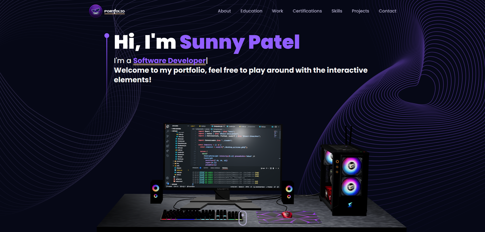

markdown


<div align="center">
# Palyam Maruthi — Personal Portfolio
<p align="center">
	<a href="https://github.com/Maruthi14-gif/Personal-Portfolio/stargazers"></a>
	<a href="https://github.com/Maruthi14-gif/Personal-Portfolio/network/members"></a>
	<a href="#tech-stack"></a>
	<a href="LICENSE"></a>
	<a href="https://maruthi14-gif.github.io/Personal-Portfolio"></a>
</p>
<p align="center">
	<a href="https://github.com/Maruthi14-gif/Personal-Portfolio/issues"></a>
	<a href="https://github.com/Maruthi14-gif/Personal-Portfolio/pulls"></a>
	
	
	
	<a href="#contributing"></a>
</p>
</div>
<p align="center">
	<picture>
		
	</picture>
</p>
An immersive, performant portfolio powered by React, react-three-fiber (Three.js), and Tailwind CSS — featuring a responsive typewriter hero section, an interactive education timeline, a project gallery with hover-induced parallax/tilt effects, and a production-ready contact form (EmailJS) with an interactive 3D Earth canvas backdrop.
<p align="center"><strong><a href="https://maruthi14-gif.github.io/Personal-Portfolio">Live Demo → GitHub Pages</a></strong></p>
<details>
	<summary><b>Table of Contents</b></summary>
- Overview
- Features
- Tech Stack
- Architecture
- Quick Start
- Environment Variables
- Scripts
- Project Structure
- Deployment
- Attributions
- Roadmap
- Contributing
- Security
- FAQ
- Maintainer
- License
- Contact
</details>
## Overview

This project is a modern single-page application scaffolded with Vite and styled with Tailwind CSS, using react-three-fiber and drei to render high-fidelity 3D scenes (like the interactive Earth backdrop). Animations are orchestrated with Framer Motion to create a premium feel.
The site is built for easy deployment to GitHub Pages, Vercel, or any other static host.
## Features
- **Interactive Hero:** Sleek greeting featuring a typing effect cycles through key specializations: Full Stack Developer, DSA Enthusiast, Cybersecurity Explorer, and Data Analyst.
- **Starfield Background:** GPU-friendly particle starfield using `maath` and R3F points.
- **Interactive Education & Experience:** Visual timeline component highlighting academic and internship milestones (e.g., IIIT Dharwad, Cyart, and Data Analyst roles).
- **Projects Gallery:** Project cards with hover parallax/tilt effects and modal detail views. Includes links to repositories and live demos.
- **Contact Section:** EmailJS-powered form with phone, email, and GitHub links, confetti success state, and an interactive 3D Earth GLTF canvas backdrop.
- **Smooth UX:** Framer Motion transitions, custom physics-based scroll behaviors, and responsive layouts.
- **Responsive + Accessible:** Tailwind JIT, mobile-aware canvas components, and contrast-mindful layouts.
## Tech Stack
- **Runtime:** React 18, React Router 6
- **3D/Graphics:** `@react-three/fiber`, `@react-three/drei`, `three`, `maath`
- **Styling:** Tailwind CSS
- **Motion:** Framer Motion
- **Forms/UI:** EmailJS (`@emailjs/browser`), `react-hot-toast`, `react-confetti`, `react-vertical-timeline-component`
- **Tooling:** Vite, ESLint
## Architecture
```mermaid
flowchart TD
  A["main.jsx"] --> B["App.jsx"]
  B --> C["Navbar"]
  B --> D["Hero"]
  B --> F["About · Education · Experience"]
  B --> G["Tech"]
  B --> H["Works · Project Cards"]
  B --> I["Contact · EarthCanvas · EmailJS"]
  B --> J["StarsCanvas"]
Quick Start
Prerequisites
Node.js 18+ (tested with Node 22.x per package.json engines)
Install and run
powershell


npm install
npm run dev
Build and preview
powershell


npm run build
npm run preview
Environment Variables
The contact form requires the following variables. Create a .env.local (or .env) in the project root:

dotenv


VITE_EMAILJS_SERVICE_ID=your_emailjs_service_id
VITE_EMAILJS_TEMPLATE_ID=your_emailjs_template_id
VITE_EMAIL_JS_ACCESS_TOKEN=your_emailjs_public_key_or_token
Used in src/components/Contact.jsx via import.meta.env.

Scripts
Script	Action
npm run dev	Start Vite dev server
npm run build	Build production assets to dist/
npm run preview	Preview the built site locally
npm run lint	Lint src/ with ESLint
Project Structure


Personal-Portfolio/
├─ index.html                   # Meta tags, root, Vite entry
├─ package.json                 # Scripts and dependencies
├─ public/
│  └─ planet/                  # GLTF planet model + CC-BY license
├─ src/
│  ├─ App.jsx                  # Route shell and section composition
│  ├─ components/              # UI sections and canvases
│  │  ├─ canvas/               # R3F scenes: Earth, Stars
│  │  └─ *.jsx
│  ├─ constants/               # Data for nav, projects, education, achievements
│  ├─ utils/motion.js          # Framer Motion helpers
│  ├─ assets/                  # Images, logos, PDFs, pfp
│  ├─ styles.js                # Shared Tailwind class tokens
│  └─ main.jsx                 # App bootstrap
└─ tailwind.config.js          # Theme, colors, hero bg
Deployment
GitHub Pages (current)
Build with npm run build and publish dist/ to Pages (e.g., via GitHub Actions or manual deploy).
Vercel (optional)
Import the repo in Vercel; framework: Vite.
Build command: npm run build, output: dist.
Attributions
3D Models (CC-BY-4.0)
Stylized planet by cmzw — https://sketchfab.com/3d-models/stylized-planet-789725db86f547fc9163b00f302c3e70 Credit: “This work is based on 'Stylized planet' by cmzw licensed under CC-BY-4.0.” See public/planet/license.txt.
Libraries
React, Three.js, react-three-fiber, drei, Tailwind CSS, Framer Motion, EmailJS, Vite, maath.
Roadmap
Add automated CI/CD for linting, building, and deploying to Pages.
Add light/dark theme toggle with persisted preference.
Add screenshot/GIF previews and Lighthouse performance docs.
Optional: switch to file-based routing and MDX-powered content.
Contributing
Contributions, issues and feature requests are welcome!

Fork the repo 2) Create a feature branch 3) Commit with clear messages 4) Open a PR
Suggested commit style: conventional commits (e.g., feat: add mobile responsive tweaks).

Security
Do not commit secrets. Use .env.local for EmailJS keys.
Report vulnerabilities privately via email: palyammaaru14@gmail.com.
FAQ
Dev server won't start?
Ensure Node 18+ (repo targets Node 22.x). On Windows, consider nvm-windows to manage versions.
Models not loading?
Confirm GLTF paths in components/canvas match files in public/.
Contact form fails?
Verify EmailJS IDs and public key/token in .env.local.
Maintainer
Palyam Maruthi	Palyam Maruthi
GitHub Profile • 
Email
 • 
Phone
⭐ If you like this project, consider starring it to support ongoing work.
License
This project is open source. See LICENSE for terms. Third-party 3D assets are licensed under CC-BY-4.0 as noted above.

Contact
GitHub: https://github.com/24bcs098-eng
Email: 
palyammaaru14@gmail.com
Phone: +91 8499850845
7:08 PM


